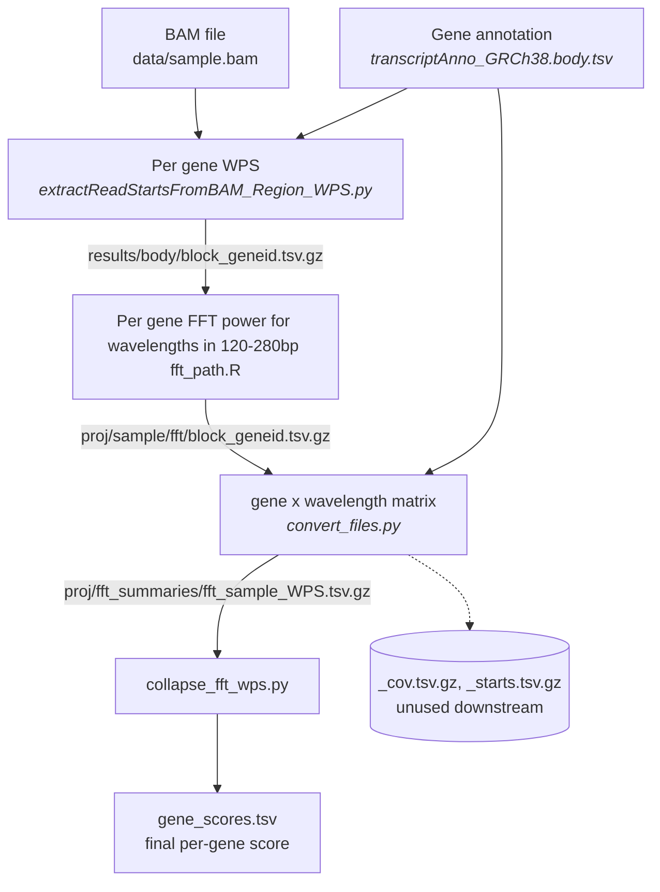

# cfDNA WPS-FFT Pipeline

## Table of contents

- [Overview](#overview)
- [Workflow](#workflow)
- [Repository structure](#repository-structure)
- [Input data format](#input-data-format)
- [Gene annotation](#gene-annotation)
- [System requirements](#system-requirements)
  - [Operating systems](#operating-systems)
  - [Software versions](#software-versions)
  - [Hardware](#hardware)
- [Installation](#installation)
- [Running the pipeline](#running-the-pipeline)
- [Output files](#output-files)
- [Important notes](#important-notes)
- [Citation](#citation)
- [License](#license)

## Overview

This pipeline computes a per-gene nucleosome periodicity score from cell-free DNA
(cfDNA) whole-genome sequencing BAM files. It follows the windowed protection score
(WPS) and Fast Fourier Transform (FFT) method from Snyder et al. (2016).

For each gene in the annotation, the pipeline:

1. Extracts per-base WPS across a 10kb window from the gene's TSS
2. Runs an FFT on the WPS curve
3. Collapses the per-gene FFT output into one gene x wavelength matrix per sample
4. Averages the 193 to 199bp frequency band per gene into a single score

The resulting score reflects how strongly a gene's cfDNA fragmentation shows the
inter-nucleosome periodicity around 193 to 199bp. This is later correlated against
cell-type gene expression (Tabula Sapiens) to estimate cell-of-origin contributions
to plasma cfDNA. That correlation step is a separate stage, not yet integrated
here. This project covers WPS and FFT extraction so far.

## Workflow



## Repository structure

```text
pipeline/
├── workflow/
│   ├── Snakefile              the 4-rule pipeline
│   ├── envs/                   conda env specs, one per rule, auto-built by Snakemake
│   │   ├── cfdna.yaml           Python 2, pysam, bx-python, samtools
│   │   ├── r.yaml                r-base
│   │   └── python3.yaml          python 3
│   ├── scripts/
│   │   └── collapse_fft_wps.py
│   └── results/                 pipeline output (gitignored)
├── annotation/
│   ├── transcriptAnno-GRCh38.tsv
│   └── transcriptAnno_GRCh38.body.tsv
├── data/                       BAM files go here (gitignored)
├── cfDNA/                      git submodule: shendurelab/cfDNA
├── cfDNA_cell_of_origin/       git submodule: JorisVermeeschLab/cfDNA_cell_of_origin
└── README.md
```

## Input data format

Place BAM files into `data/`. Every `*.bam` file found there
is automatically treated as individual sample.

```text
data/
├── sample1.bam
├── sample2.bam
└── ...
```

## Gene annotation

The gene annotations were extracted from the Ensembl GRCh38 GTF (release 116):
https://ftp.ensembl.org/pub/current/gtf/homo_sapiens/Homo_sapiens.GRCh38.116.gtf.gz

`transcriptAnno-GRCh38.tsv` lists one row per 
gene: Ensembl gene ID, chromosome, start, end, and strand.

Filtered to only include canonical transcripts that also carry a CCDS tag (19,119 genes total)

The `transcriptAnno_GRCh38.body.tsv` contains the same gene annotations but remapped to the first 10kbp from their TSS. These genomic regions are used for the WPS and FFT analysis.  


| gene_id | chrom | start | end | strand |
|---|---|---|---|---|
| ENSG00000189337 | 1 | 14598685 | 14608684 | + |
| ENSG00000276747 | 1 | 17372196 | 17382195 | + |
| ENSG00000283039 | 1 | 44137821 | 44141630 | - |


## System requirements

### Operating systems

macOS and Linux. Tested on macOS (Apple Silicon).

### Software versions

Only conda and Snakemake 9 or newer need to be installed manually. 
Snakemake builds every environment it needs (`envs/cfdna.yaml`, `envs/r.yaml`, `envs/python3.yaml`) automatically the first time the pipeline runs.
### Hardware

...

## Installation

```bash
git clone --recurse-submodules https://github.com/aalllee/cell_of_origin_analysis.git pipeline
cd pipeline
```

## Running the pipeline

From `workflow/`, runs all 4 rules for every sample found in `bam_dir`.
`bam_dir` is required, passed via `--config`, no default. `annotation` defaults
to the real gene annotation, override it the same way if needed:

**Linux, or Intel Mac:**

```bash
#adjust -c arg based on your available cores

#Linux or Intel Mac
snakemake --use-conda -c4 -p --config bam_dir=../data/

#Apple Silicon
CONDA_SUBDIR=osx-64 snakemake --use-conda -c4 -p --config bam_dir=../data/

```

### Test data

Included a small sample of test data under `test_data/` that might be used as 
a sanity check to verify that the pipeline runs fine on your machine. 

```bash
#run from /workflow

snakemake --use-conda -c4 -p \
  --config bam_dir=../test_data/bams/ annotation=../test_data/test_annotation.tsv
```

## Output files

For each sample the workflow outpus a gene scores file (`results/<sample>/gene_scores.tsv`), which containes the FFT power per gene, averaged over 193-199bp wavelengths. Ultimatelly this gene vector will be correlated agains single cell gene exrpession dataset.

```text
gene_id	fft_wps_193_199
ENSG00000000003	1424.35
ENSG00000000005	5626.58
ENSG00000000419	1419.82
...
```
One row per gene with nonzero coverage.

The workflow also stores intermediate files under `results/<sample>/`:

```text
body/                    per-gene WPS 
proj/<sample>/fft/       per-gene FFT 
proj/fft_summaries/      the 3 collapsed matrices: cov, starts, WPS 
```


## Citation

Snyder MW, Kircher M, Hill AJ, Daza RM, Shendure J. Cell-free DNA Comprises an In
Vivo Nucleosome Footprint that Informs Its Tissues-Of-Origin. Cell. 2016
Jan 14;164(1-2):57-68. doi:10.1016/j.cell.2015.11.050

Cell type signatures in cell-free DNA fragmentation profiles reveal disease
biology. Nature Communications. 2024;15:2220. doi:10.1038/s41467-024-46435-0

## License

See the license files inside the `cfDNA` and `cfDNA_cell_of_origin` submodules for
the terms covering the underlying source code reused here. This repository itself
does not yet have a separate license file.
